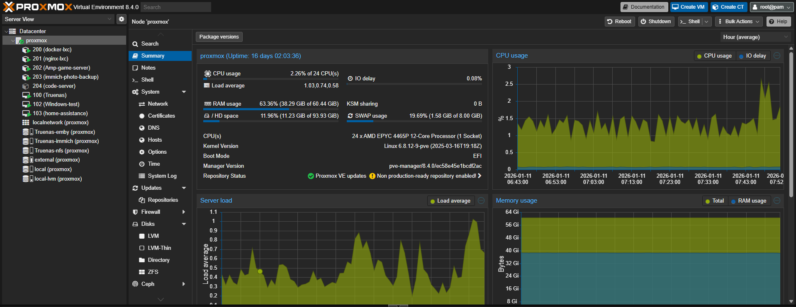
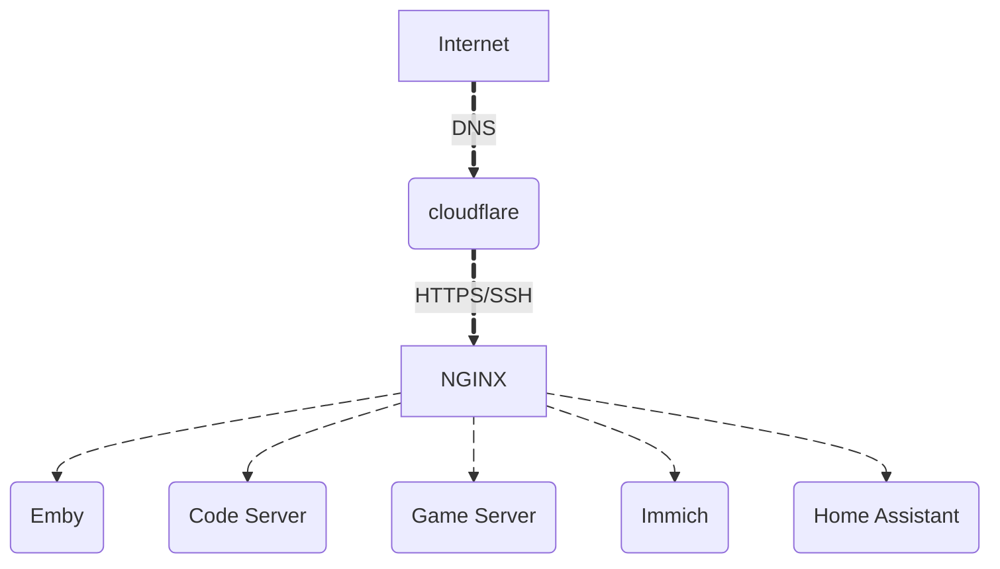

# Homelab - proxmox server
> A self-guided project that hosts and solves most of my daily internet needs, combining the benefits of online services while keeping full control of my own data with redundancy.

Welcome to my homelab repository! This is a showcase of my personal lab environment where I experiment with virtualization, networking, containerization, and automation. It highlights the infrastructure, services, and technical skills I’ve built and maintained, which are relevant to IT, DevOps, and system administration roles.

*Screenshot of my VM and LXC setup*

## Homelab Overview

| Component        | Details |
|-----------------|---------|
| **Server Hardware** | Home-built server running Proxmox VE |
| **VMs** | Windows VM, Home Assistant VM, TrueNAS VM |
| **LXC Containers** | NGINX reverse proxy, Emby media server, Cloudflare DDNS updater, code-server, game servers, Immich backup service |
| **Networking** | VLANs, firewall rules, Cloudflare DDNS, internal/external routing |
| **Storage** | Managed by TrueNAS VM: datasets for VMs, media, backups, game files, and mobile photo backups |
---

## Key Services & Projects

- **NGINX Reverse Proxy (LXC)**  
  - Serves all web apps securely with HTTPS and custom routing.  
  - Ensures a **minimal number of open ports** on the home network, reducing attack surface.  
  - Provides **centralized SSL termination** and secure routing for all services.  
- **Emby Media Server (LXC)** – Centralized media library for movies, TV shows, and music.  
- **Cloudflare DDNS (LXC)** – Automatic DNS updates for external access to services.  
- **code-server (LXC)** – Remote VS Code development environment accessible over the network.  
- **Game Server (LXC)** – Hosted multiplayer game servers for testing and personal use.  
- **Immich Backup (LXC)** – Mobile photo and video backup server.
---
- **Home Assistant (VM)** – Automation platform managing smart home devices.  
- **Windows (VM)** – For software testing, legacy apps, and general-purpose usage.  
- **TrueNAS VM** – Enterprise-style storage management for datasets, backups, and redundancy.
---

## Technical Skills Showcased

- **Virtualization & Containerization:** Proxmox VE, LXC, VM management  
- **Networking & Security:** NGINX reverse proxy, VLANs, Cloudflare DDNS, HTTPS Certificates, firewall configuration  
- **Server Administration:** Linux system administration, Windows VM management, storage provisioning with TrueNAS  
- **Media & File Management:** Emby media server setup, automated backups with Immich  
- **Dev & Remote Tools:** code-server for remote development, game server hosting  
- **Automation:** Scripted service management, automated DNS updates  

---

## DNS & External Access

- Cloudflare DDNS automatically updates public hostnames whenever IPs change.  
- **NGINX acts as a single entry point**, exposing only required ports (80/443) to the internet, keeping all other services isolated.  
- External traffic is securely routed to the correct LXC container or VM internally.  
